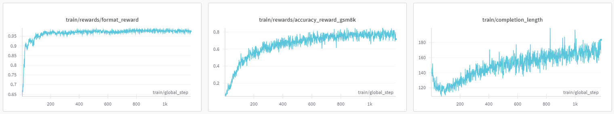

# Open-R1-Vision
**One-click start reproduction of multi-modal DeepSeek R1-Zero**

Extended version of open-R1 featuring **multimodal GRPO training** with seamless Docker deployment and Slurm integration.

## Key Features ✨

- 🤖 **A More Perfect Reproduction** - The demo in Open-R1 did not replicate the phenomenon of increased response length. However, the modified version here successfully demonstrates this phenomenon with longer responses.
- 🔧 **Zero Compatibility Issues** - The GRPO algorithm is undergoing rapid iterations. The code of the trl, vllm, and transformers packages have been reviewed to ensure that there are no compatibility issues with the current version.
- 🌐 **Multi Dataset Support** - Support both textual datasets and multimodal datasets.
- ⚡ **Pre-built Docker Image** - To minimize the cost of environment configuration and improve reproduction efficiency, not only a Dockerfile is provided but also a pre-built image to ensure developers can quickly restore the experimental environment.
- 🚀 **One-Click Training on Slurm** - Docker cannot be used on Slurm, so we provide Singularity commands to support large-scale training on Slurm.

## Results
- Training logs on GSM8K
  

- Training logs on GeoQA (to be release)

## Quick Start ▶️

### Prerequisites
- Singularity ≥ 3.6
- Slurm client (optional for local execution)

### Launch Training:
```bash
git clone https://github.com/alexxchen/open-r1-vision.git
cd open-r1-vision
./start_run.sh
```
The script will automatically:
1. Pull the pre-built Docker image and convert it into singularity image
2. Launch Slurm job with optimal default parameters

### Slurm Configuration ⚙️
Customize training resource and parameters in slurm_singularity_text.sh or slurm_singularity_vision.sh

### Training Configuration
Modify config_text.yaml or config_vision.yaml for:
+ Adjust Hugginface model name 
+ Adjust Hugginface dataset name (Note: modification of the reward accuracy function in reward.py is needed for different datasets)
+ GRPO optimization settings

### License 📄
Apache 2.0 - See LICENSE for details

## Acknowledgments 🌟
Sincerely thank to [open-R1](https://github.com/huggingface/open-r1) and [R1-V](https://github.com/Deep-Agent/R1-V) 
